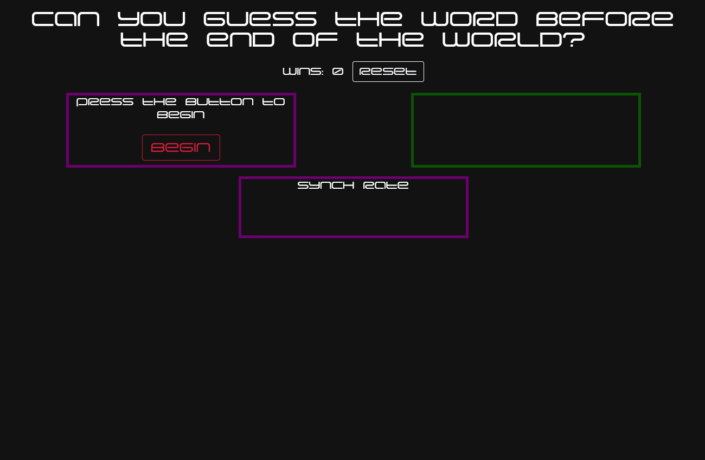
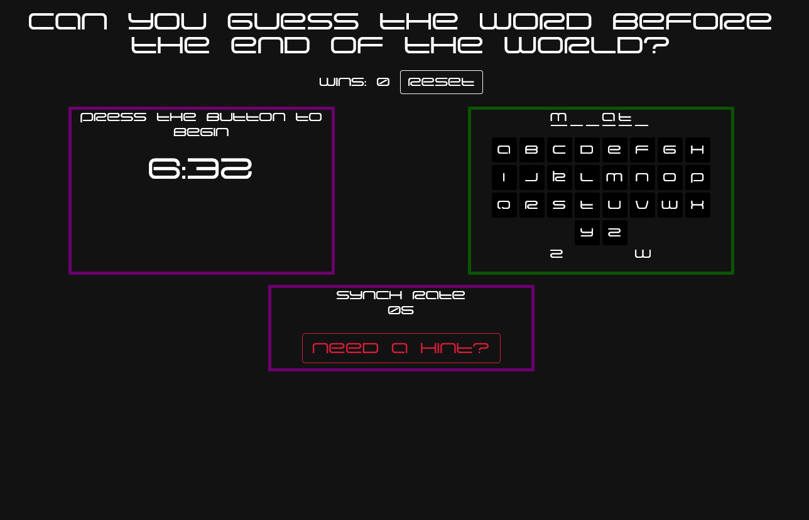

# Hangman Game

## Acceptance Criteria

- As a user, I want to start the game by clicking on a button.

- As a user, I want to try and guess a word by filling in a number of blanks that match the number of letters in that word.

- As a user, I want the game to be timed.

- As a user, I want to win the game when I have guessed all the letters in the word.

- As a user, I want to lose the game when the timer runs out before I have guessed all the letters or if I have run out of guesses.

- As a user, I want to see my total wins and on the screen.

### Specifications

- When a user presses a letter key, the user's guess should be captured as a key event.

- When a user correctly guesses a letter, the corresponding blank "_" should be replaced by the letter. For example, if the user correctly selects "a", then "a _ _ a _" should appear.

- When a user wins or loses a game, a message should appear and the timer should stop.

- When a user clicks the start button, the timer should begins. Resets in the case of a user starting a new game.

- When a user refreshes or returns to the brower page, the win counts should persist.

## Usage
Users can play a simple hangman game by clicking the "Begin" button. Users must guess the word by clicking or typing letters to spell the correct word. The game is themed with words/names from the anime Neon Genesis Evangelion. 

Users have 7 lives, meaning if they guess a letter incorrectly 7 times then they lose. The game is also timed and the user must guess the word correctly within the alotted time or they will lose. The number of times a user has won will display at the top of the page and will persist in local storage until the user clicks the "Reset" button to reset their win count. 

Users can click the "Need a hint" button to be given a succinct hint about the word they are guessing. These are largely helpful if you have seen the show and are familiar with the show's meme culture. 

## Credits

Font sourced from https://www.fonts4free.net/eva-font.html

## License
MIT License

## Badges

